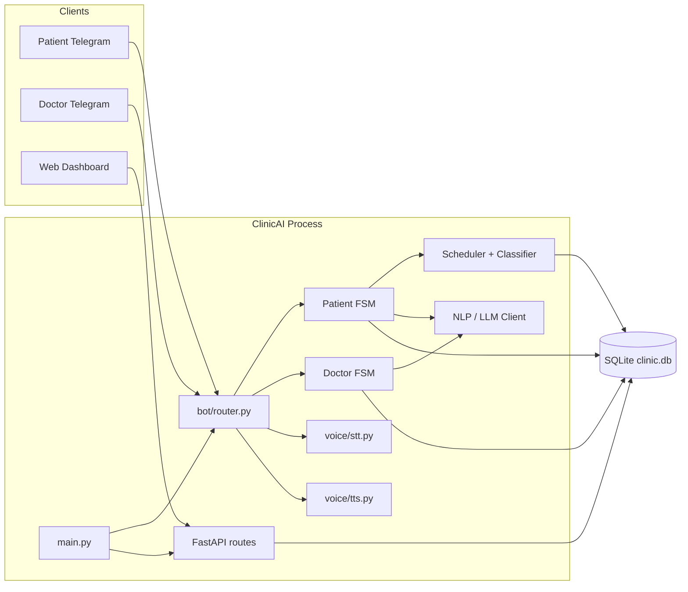
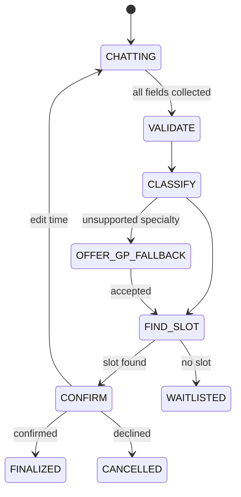

# ClinicAI

ClinicAI is an Arabic-first clinic appointment assistant that connects patients and staff through **Telegram**, backed by a **SQLite** database and a **FastAPI** web dashboard. Patients book visits via a conversational finite-state machine (FSM); the system classifies complaints, scores clinical urgency, assigns specialty slots, and records the full journey from chat to completed visit.

Designed for Palestinian Arabic (informal dialect), with local Whisper speech-to-text and optional voice replies via Edge TTS.

---

## Features

### Patient Telegram bot
- **LLM-first free conversation** for booking (name, complaint, urgency, preferred time) via `nlp/booking_agent.py`
- Rule-based field extraction when the LLM is offline; classifier, priority, and scheduling unchanged
- **Rule-based Arabic specialty classifier** with LLM fallback when rules are inconclusive
- **Priority engine** (P1 / P2 / P3) from complaint, urgency, follow-up, specialty, and timing signals
- **Natural-language handling** at confirmation (informal yes/no, “why?”, slot browsing, decline)
- Main menu actions via free text: new booking, appointment inquiry, cancel, contact clinic
- **Voice messages**: Whisper transcription; optional TTS voice replies (`auto` mode replies with voice when the patient sent voice)
- FSM sessions persisted in the database (survives bot restarts)

### Doctor Telegram bot
- Registered doctors (linked by `telegram_id`) can log clinical sessions by text or voice
- Structured fields: chief complaint, diagnosis, medications, investigations, follow-up
- Sessions linked to patients and appointments when possible

### Web dashboard
- Live queue for today’s appointments
- Day schedule with priority, complaint summary, and slot status
- Patient search, conversation history, raw message logs
- Clinical sessions view; register a session from an existing appointment
- Doctor/clinic and slot overview

### Scheduling & safety rules
- Doctor-owned clinics: each doctor represents one specialty/clinic and owns slots
- Priority-based slot reservation (P1 can use more tiers than P3)
- Wave horizons: urgent patients see nearer slots; routine patients see up to 30 days ahead
- **Duplicate booking prevention**: no overlapping active appointments; no same-specialty same-day duplicates
- Waitlist when no slot is available
- Atomic slot booking with re-read before commit

---

## Architecture



On startup, `main.py`:

1. Initializes and migrates the database, seeds doctors and demo slots
2. Starts the dashboard in a background thread
3. Runs the Telegram bot with long polling (main thread)

---

## Tech stack

| Layer | Technology |
|-------|------------|
| Language | Python 3.11+ (tested on 3.13) |
| Bot | python-telegram-bot 22.x |
| API / dashboard | FastAPI, Uvicorn, Jinja2 |
| Database | SQLite, SQLAlchemy 2.x |
| STT | OpenAI Whisper (local) |
| TTS | edge-tts (Palestinian Arabic voice) |
| LLM primary | OpenRouter (`openai/gpt-4.1-mini` by default) |
| LLM fallback | Google Gemini / Gemma |
| Tests | pytest, pytest-asyncio |

---

## Prerequisites

- **Python 3.11+**
- **ffmpeg** on `PATH` (required for voice message conversion)
- A **Telegram bot token** from [@BotFather](https://t.me/BotFather)
- At least one of:
  - **OpenRouter API key** (recommended primary LLM), or
  - **Google Gemini API key** (fallback / standalone)
- Optional: CUDA-capable GPU speeds up Whisper; CPU works with `WHISPER_MODEL=small`

---

## Quick start

### 1. Clone and create a virtual environment

```bash
git clone <repository-url>
cd ClinicAI
python -m venv .venv

# Windows
.venv\Scripts\activate

# Linux / macOS
source .venv/bin/activate
```

### 2. Install dependencies

```bash
pip install -r requirements.txt
```

First run downloads the Whisper model (size depends on `WHISPER_MODEL`).

### 3. Configure environment

```bash
cp .env.example .env
```

Edit `.env` and set at minimum:

- `TELEGRAM_BOT_TOKEN`
- `OPENROUTER_API_KEY` and/or `GEMINI_API_KEY`

See [Configuration](#configuration) for all variables.

### 4. Run the application

```bash
python main.py
```

Expected console output:

```
🏥 ClinicAI starting...
✅ Database ready
✅ Dashboard → http://localhost:8000
✅ Bot is running (Telegram: direct). Press Ctrl+C to stop.
```

Open the dashboard at `http://localhost:8000` and message your bot on Telegram.

---

## Configuration

Copy `.env.example` to `.env`. **Never commit `.env`** — it is listed in `.gitignore`.

| Variable | Description | Default |
|----------|-------------|---------|
| `WHISPER_MODEL` | Whisper size: `small`, `medium`, `large` | `small` |
| `DASHBOARD_HOST` | Dashboard bind address | `localhost` |
| `DASHBOARD_PORT` | Dashboard port | `8000` |
| `TELEGRAM_BOT_TOKEN` | Bot token from BotFather | *(required)* |
| `TELEGRAM_TRUST_ENV` | Use system `HTTP_PROXY` env vars | `false` |
| `TELEGRAM_PROXY` | Explicit proxy URL (optional) | — |
| `OPENROUTER_API_KEY` | OpenRouter API key | — |
| `LLM_PRIMARY_MODEL` | Primary model slug | `openai/gpt-4.1-mini` |
| `GEMINI_API_KEY` | Google Gemini API key | — |
| `LLM_FALLBACK_MODEL` | Fallback model | `gemma-4-31b-it` |
| `TTS_ENABLED` | Enable text-to-speech | `true` |
| `TTS_RESPONSE_MODE` | `text`, `voice`, `both`, `auto` | `auto` |
| `TTS_VOICE` | Edge TTS voice name | `ar-PS-SamaNeural` |
| `CLINIC_NAME` | Used in LLM system prompts | `العيادة` |
| `USE_SLOT_POLICY` | Unified slot ranking policy | `true` |

Additional Telegram timeout and retry settings are defined in `config.py` with sensible defaults.

---

## Project structure

```
ClinicAI/
├── main.py                 # Entry point: DB + dashboard + bot
├── config.py               # Environment configuration
├── bot/
│   ├── router.py           # Patient vs doctor routing
│   ├── keyboards.py        # Telegram reply keyboards
│   └── handlers/
│       ├── patient.py      # Booking, voice, TTS, menu actions
│       └── doctor.py       # Session documentation
├── fsm/
│   ├── patient_fsm.py      # Patient booking state machine
│   ├── doctor_fsm.py       # Doctor session state machine
│   ├── services.py         # Booking / slot / waitlist services
│   └── fsm_result.py       # UI action → keyboard mapping
├── scheduler/
│   ├── classifier.py       # Arabic complaint → specialty rules
│   ├── priority.py         # Priority scoring (P1–P3)
│   ├── scheduler.py        # Slot search and planning
│   └── slot_policy.py      # Reservation tiers and ranking
├── nlp/
│   ├── booking_agent.py    # LLM-first patient booking turns + rule fallback
│   ├── gemini_client.py    # OpenRouter + Gemini LLM client
│   ├── normalizer.py       # Arabic text normalization
│   └── extractor.py        # Field extraction helpers
├── voice/
│   ├── stt.py              # Whisper transcription
│   └── tts.py              # Edge TTS → Telegram OGG
├── database/
│   ├── db.py               # Init, migrations, seed data
│   ├── models.py           # SQLAlchemy models
│   └── crud.py             # Data access layer
├── dashboard/
│   ├── routes.py           # FastAPI routes + API
│   └── templates/          # Jinja2 HTML pages
├── tests/                  # pytest suite
├── docs/
│   └── scheduling_policy.md
└── ClinicAI_theory_design_notes.md   # ERD and design reference
```

---

## Patient booking flow



The patient bot uses an LLM-driven **CHATTING** phase for natural Palestinian Arabic dialogue. When name, complaint, urgency, and time preference are complete, the existing classifier, priority engine, and slot pipeline run unchanged. Confirmation stays natural-language; there are no Telegram reply keyboards — patients type freely (e.g. «حجز موعد جديد», «شو موعدي», «إلغاء موعد»).

---

## Seeded clinics

On first run, the database seeds **11 doctors/clinics**, including:

| Specialty | Clinic code |
|-----------|-------------|
| General practice | CLINIC-GP |
| Cardiology | CLINIC-CARD |
| Neurology | CLINIC-NEURO |
| Orthopedics | CLINIC-ORTHO |
| Pediatrics | CLINIC-PED |
| Gynecology | CLINIC-GYN |
| Dentistry | CLINIC-DENT |
| Dermatology | CLINIC-DERM |
| Gastroenterology | CLINIC-GI |
| Chronic diseases | CLINIC-CHR |
| Elderly care | CLINIC-ELD |

Demo appointment slots are auto-generated for the next **14 days** per active doctor.

Some specialties are routed to **general practice fallback** in Telegram when they are not directly bookable via the patient UI. See `docs/scheduling_policy.md` for the current policy.

---

## Doctor access

Doctors use the **same bot** as patients. Routing is based on `doctors.telegram_id`:

1. Add or update a row in the `doctors` table with the doctor’s Telegram user ID
2. The doctor sends `/start` and sees the doctor menu (today’s appointments, new session, etc.)

Doctors without a linked Telegram account can still appear on the dashboard; sessions can be created from the web UI against existing appointments.

---

## Dashboard pages

| Route | Purpose |
|-------|---------|
| `/` | Today’s queue and summary stats |
| `/appointments` | Day schedule (navigate by date) |
| `/patients` | Patient search |
| `/conversations` | Telegram conversation threads |
| `/logs` | Raw inbound/outbound messages |
| `/sessions` | Clinical session records |
| `/doctors` | Clinics, doctors, and slot overview |

---

## LLM usage

The LLM layer (`nlp/gemini_client.py` + `nlp/booking_agent.py`) is used for:

- **Patient booking conversation** (`booking_turn`): natural replies + structured field extraction each turn
- Context-aware replies when rule-based answers are inadequate
- Answering patient questions during booking (without giving medical advice)
- Specialty classification fallback when regex rules do not match

**Primary:** OpenRouter  
**Fallback:** Google Gemini / Gemma when OpenRouter is unavailable or rate-limited

The bot is instructed to stay within booking scope, use Palestinian Arabic, and avoid repeating robotic keyboard instructions.

---

## Voice pipeline

```
Telegram OGG → ffmpeg → WAV → Whisper → text → FSM
                                              ↓
                                    reply text → edge-tts → OGG voice (optional)
```

- **STT** runs fully locally via Whisper (`WHISPER_MODEL` in `.env`)
- **TTS** failures never block booking; text replies always remain the fallback
- `TTS_RESPONSE_MODE=auto` sends voice only when the patient sent a voice message

---

## Testing

```bash
pytest
```

Or a focused subset:

```bash
pytest tests/test_patient_fsm.py tests/test_classifier.py -q
```

The suite covers FSM flows, scheduling policy, CRUD, classifier rules, Telegram navigation mocks, and LLM client behavior.

---

## Development notes

- **Single process**: dashboard and bot share one SQLite file (`database/clinic.db`). Avoid running two bot instances against the same DB.
- **FSM persistence**: active sessions live in `fsm_sessions` with periodic cleanup (24h TTL).
- **Migrations**: lightweight SQLite migrations run inside `database/db.py` on startup — no separate Alembic step.
- **Design reference**: see `ClinicAI_theory_design_notes.md` for ERD, priority weights, and version history (V3 sessions, V4 booking guards, doctor-owned slots).

---

## Security

- Keep API keys and `TELEGRAM_BOT_TOKEN` in `.env` only
- Use `.env.example` as a template without secrets
- The dashboard has no built-in authentication in the default setup — do not expose it publicly without adding access control
- The bot does not provide medical diagnosis; it schedules appointments and collects administrative information

---

## Troubleshooting

| Issue | Suggestion |
|-------|------------|
| Telegram timeouts on Windows | Keep `TELEGRAM_TRUST_ENV=false` unless you need a proxy; set `TELEGRAM_PROXY` explicitly if required |
| Voice transcription fails | Ensure `ffmpeg` is installed and on `PATH` |
| Dashboard port in use | Change `DASHBOARD_PORT` or stop the other process; the bot still runs if the port is busy |
| Whisper slow on first message | Expected — model loads once; use `WHISPER_MODEL=small` for faster CPU inference |
| LLM replies missing | Verify `OPENROUTER_API_KEY` and/or `GEMINI_API_KEY` in `.env` |

---

## License

See repository license file if present; otherwise treat as private/academic project unless stated otherwise.
